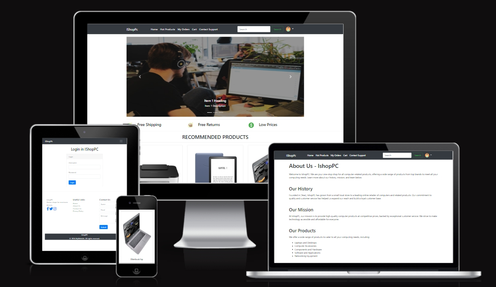

# Ishope

## Table of Contents

 

### Business Plan
- Its online shope, We are your one-stop shop for all computer-related products, offering a wide range of products from top brands to meet all your computing needs. 
- At IshopPC, our mission is to provide high-quality computer products at competitive prices, backed by exceptional customer service. We strive to make technology accessible and affordable for everyone.

### Operations and Management:
- IshopePc  will be operated and managed by a small team of experienced professionals. The team will consist of a CEO, CTO, and marketing and sales staff.

- In regards to operations, our approach involves leveraging a cloud-based platform for hosting the website and software, along with a payment gateway to facilitate transaction processing. Additionally, we will make use of third-party fulfillment centers to manage the storage, packaging, and shipment of products bought through our ecommerce store.

### Conclusion:
-  At IshopPC, our goal is to offer top-notch computer merchandise at competitive rates, supported by outstanding customer service. Our aim is to ensure that technology is within reach and affordable for all.

### Marketing
- The online application "ishopPc" maintains an active presence on both Facebook and Instagram. The Facebook page serves as a platform for promoting upcoming events, sharing updates on the latest features, and showcasing user-generated content. On the other hand, the Instagram page primarily focuses on displaying exquisite products, highlighting new additions to the shop, and offering a glimpse into the company's behind-the-scenes activities. By following these social media accounts, users can stay updated and connected with the vibrant "ishopPC" community.

[Facebook](https://www.facebook.com/profile.php?id=100088722476900)  
[Instagram](https://www.instagram.com/teetimegolfapp/)

### User Goals
- To effortlessly and conveniently buy items.
- To explore and buy a diverse selection of computer-related products from the online store.
- To easily reach the main page for making purchases.
- To get in touch with the ishopPc team for any questions or assistance through the contact page.

### Site Owner Goals
- Drive sales by offering products for purchase on the ecommerce store
- Cultivate a dedicated customer following through a user-friendly interface and top-notch merchandise
- Position ishopPc as a reputable and esteemed name in the digital retail sector
- Attain financial success and ensure ongoing expansion.

### User Experience

- Those seeking information and resources regarding computer products,
- Any person interested in buying PC-related products from the app's online store.

### User Requirements and Expectations
- A user-friendly interface: Users will expect the app to be easy to navigate and use, with clear and concise instructions for purchasing products.
- Reliability: Users will expect the app to be reliable and function smoothly, without any errors or technical issues.
- Security: Users will expect their personal and financial information to be secure when using the app, and will expect the app to have appropriate 
  measures in place to protect their data.
- Accurate and up-to-date information: Users will expect the app to provide accurate and up-to-date information about the products.
- Competitive prices: Users will expect the prices for products to be competitive with other options available on the market.
- Good customer service: Users will expect the app to have good customer service, including responsive and helpful support in the event of any issues or questions.

### Kanban, Epics & User Stories
- GitHub Kanban was used to track all open user stories
- Epics were created using the milestones feature
- Backlog, In Progress, Done headings were used in the kanban

### Design
Colors
- Colors are black and white, it looks very prominent.

Fonts
- The font selected was from Google Fonts,

### Structure
- The website was created with the intention of making the user comfortable with the arrangement, which includes a navigation bar positioned at the 
  top of each page and a hamburger menu button for smaller screens.

- In addition, the footer section encompasses all pertinent social media links associated with the business. This allows users to easily access and 
  follow the business on various social media platforms, thereby increasing the number of followers, likes, and shares. The footer also includes an email sign-up form, useful links, and contact information.

### Website pages

 #### The site consists of the following pages:

- Home
- Hot Products 
- Order List
- Edit Booking
- Cancel Booking
- Product List
- Cart
- Checkout
- Checkout Success
- Contact
- Register
- Profile
- Login
- Logout
- Reset Password
- Register
- 404

### Database
 - I constructed my database utilizing PostgreSQL, a renowned open-source object-relational database system recognized for its reliability, 
   robustness, and performance. I opted for PostgreSQL due to its ability to offer a versatile solution for effectively handling and structuring my data.

### Technologies Used
#### Languages & Frameworks

- HTML
- CSS
- Javascript
- Python
- Django

### Libraries & Tools

#### Libraries & Tools
- Am I Responsive
- Bootstrap v5.2
- Favicon.io
- Chrome dev tools
- Font Awesome
- Git
- GitHub
- Google Fonts
- Heroku Platform
- jQuery
- Postgres

### Features

#### Search Engine Optimisation (SEO)
- I have used meta tags in the HTML of my web app's pages to optimize them for search engines. The description tag provides a brief summary of the content on the page, while the keywords tag lists relevant keywords to help search engines understand the content of the webpage and its relevance to 
 related search queries.

 #### Home page
 - Home page includes nav bar, main body and a footer.
 
#### Navigation

- Fully Responsive.
- On small screens switches to hamburger menu.
- Indicates login/logout in status.
- displayed on all pages.

#### Footer

- Contains social media links, privacy policy, and copyright.
- displayed across all pages.

#### Sign up / Register

- Allow users to register an acoount.

#### Sign In

- User can sign in.

#### Sign Out
- Allows the user to securely sign out.
- Ask user if they are sure they want to sign out.

#### Cancel Booking

- Allows the user to cancel their bookings.

#### clear Cart
- cancel the cart products

#### Shop

- Allows the user to view the listed products in the shop.

#### product Detail

- Allows the user to view the products details.

#### Add Product

- Allows the Admin to add new products.

#### Contact Us / Send Message

- A contact page with all contact details listed
- Users can send a message via the message form

#### Social Media Links

- Links are used for the Facebook business page and Instagram page.
- All links open in a new tab to ensure the user is not directed away from the business.

### Deployment

#### Heroku
- 